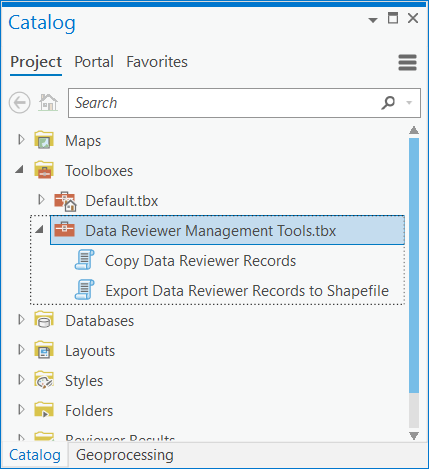
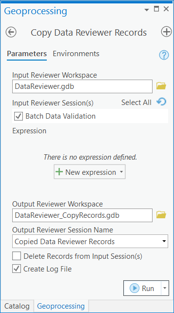
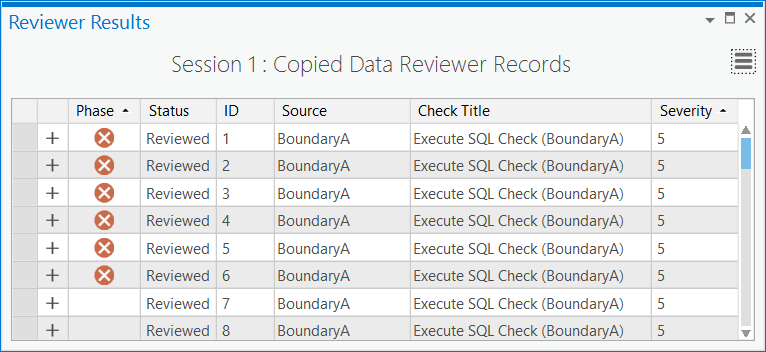
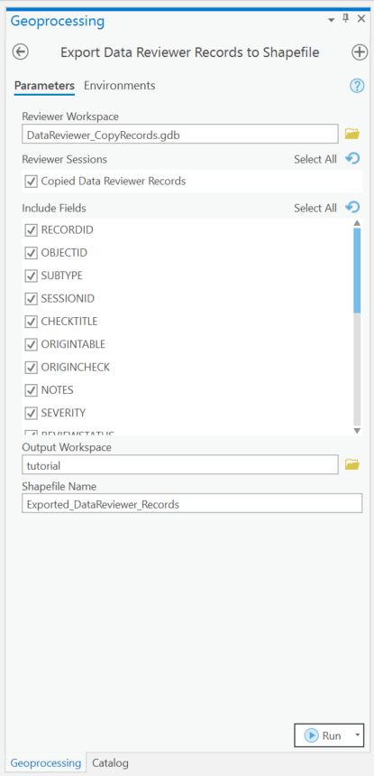

Manage Data Reviewer records 
=============================

Tutorial summary
================

This tutorial guides you through using a sample workspace and a set of python
scripts that allow you to manage ArcGIS Data Reviewer records. This tutorial is
recommended if you use Data Reviewer and work with multiple Reviewer workspaces
or work with others that don’t have Data Reviewer.

**Estimate time**

25 minutes 

**Software requirements**
1. Install ArcGIS Pro 2.5 or later (with Data Reviewer license)
  	>Note: If you currently do not have a license for ArcGIS Data Reviewer, you can request a free 21-day trial.
2. From the landing page of this repository, click on the **Code** tab.
3. Click the **Clone or download** button.
4. Choose **Download Zip** and specify a location.
5. Browse to the download location you specified to find the zip file.
5. Extract the contents in the zip file to a convenient location on your computer, such as C:\\\\Data_Reviewer.
	>Note: The toolbox and tools used in the tutorial are found in the **source** subfolder of the extracted content.

The **Data Reviewer Management Tools** toolbox contains the following two tools.

-   The **Copy Data Reviewer Records** tool takes records from one or more
    Reviewer sessions and copies them into another Reviewer session. It works
    with sessions in the same Reviewer workspace or different ones, projects
    records to a common spatial reference if the input and output Reviewer 
    workspaces have different spatial references, and deletes records from 
    input sessions. You can use this tool to archive records by copying them 
    from your active Reviewer workspace to another workspace or even consolidate
    records from multiple workspaces.

-   The **Export Data Reviewer Records to Shapefile** tool exports all the
    Reviewer records in a selected workspace to a single multi-point shapefile.
    The geometries of the input records are converted to points that are
    included in the output shapefile (.shp) and a table (.dbf) is created for
    records that do not have associated geometry. You can use this tool to
    export and share records and information with others that do not have Data
    Reviewer.

**Data requirements**

The data for this tutorial is available in the extracted **tutorial** subfolder from the downloaded zip file. 
The zipped content in the **tutorial** folder contains an ArcGIS Pro project package preloaded with sample data from the Austin, Texas and a sample Data Reviewer workspace geodatabase preloaded with error records.

1. Browse to the **tutorial** subfolder in the extracted content.
2. Extract the **tutorial** subfolder's content to a convenient location on your computer, such as C:\\\\Data_Reviewer\tutorial

Copy records
============

In this section you will use the **Copy Records** tool to copy records from one Reviewer workspace to another.

1.  In the **Catalog** pane, right-click **Toolboxes** and click **Add Toolbox**.

2.  In the **Add Toolbox** dialog box, browse to \<your extracted location\>\\source and
    choose the **Data Reviewer Management Tools** toolbox.

3.  Click **OK**.

4.  In the **Catalog** pane, expand the **Data Reviewer Management Tools** toolbox.

  

5.  Double-click the **Copy Data Reviewer Records** tool.
	>The **Copy Data Reviewer Records** pane appears.

6.  For the **Input Reviewer Workspace** parameter, click the **Browse** button, browse to \<your extracted location\>\\tutorial, and choose the **DataReviewer.gdb** file folder.
    
7.  Click **OK**.

8.  Check the **Batch Data Validation** check box in the **Input Reviewer
    Session(s)** list.

9.  For the **Output Reviewer Workspace** parameter, click the **Browse** button.

10. In the **Output Reviewer Workspace** dialog box that appears, browse to \<Project\>\\Folders\>\\DataReviewer_ManageRecords_1ec5e6\>\\p20\>\\**DataReviewer_CopyRecords.gdb** and choose it.
    
10. Click **OK**.

11. Click the **Output Reviewer Session Name** drop-down arrow and choose
    **Copied Data Reviewer Records**.

12.  Ensure that the **Create Log File** check box is checked to record
    information to a log file about any errors that are copied.

13. Click **Run**.

	>Note: This may take a few minutes since it is exporting all the records from the input Reviewer session.

14.  To review the results in more detail, open the log file that gets created at \<your extracted location\>\\tutorial.

Preview copied records
----------------------

The Reviewer Results table contains all the records resulting from a review. In
this exercise, you will use Reviewer Results table to organize the error records
that were copied into the Copied Data Reviewer Records session.

1.  Expand **Session Results**, right-click **Copied Data Reviewer Records** and
    click **Open**.

The Reviewer Results table appears with the copied records.

 

>   *Reviewer table records grouped by Source and Check Title*

Learn more about [phases of error results](https://pro.arcgis.com/en/pro-app/help/data/validating-data/results-and-life-cycle-phases.htm) and how to [configure](https://pro.arcgis.com/en/pro-app/help/data/validating-data/configure-the-reviewer-results-pane.htm) the Reviewer Results pane.

Export records to a shapefile
=============================

In this exercise, you will use the **Export Data Reviewer Records to Shapefile**
tool to export the copied records to a shapefile.

1.  In the **Catalog** pane, expand **Toolboxes** and expand **Data Reviewer**
    **Management Tools** toolbox.

2.  Double-click the **Export Data Reviewer Records to Shapefile** tool.

3.  Click the **Browse** button next to **Reviewer Workspace**, browse to \<Project\>\\Folders\>\\DataReviewer_ManageRecords_1ec5e6\>\\p20\>\\**DataReviewer_CopyRecords.gdb** and choose it.

4. Click **OK**.

5.  In the **Reviewer Sessions** parameter, check the **Copied Data Reviewer Records** check box.

6.  In the **Include Fields** parameter, click **Select All** to include all the fields.

7.  Click the **Browse** button next to **Output Workspace**, browse to \<your extracted location\>, and choose the tutorial folder.

8.  Click **OK**.

9.  In the **Shapefile Name** parameter, type **Exported_DataReviewer_Records**.

10.  Click **Run**.

	>Note: This may take a few minutes since it is exporting all the records from the input Reviewer session.

11.  If necessary, click **Close** on the *Export Data Reviewer Records to Shapefile* processing window once it is finished.

Preview exported records
------------------------

In this exercise, you will preview one of the exported records and verify its
attributes match those of its corresponding error record in the Reviewer Results
table.

1.  Click the **Insert** tab.

2.  Click **New Map**.

3.  Click the **Map** tab.

4.  Click **Add Data** and browse to the **Exported_DataReviewer_Records.shp** at
    \<your extracted location\>\\tutorial.

5.  If necessary, open the Reviewer Results table with **Copied Data Reviewer
    Records** session.

	>Note: The Reviewer Results table should have been left open. If it was closed, see the previous exercise titled **Preview copied records**.

6.  Click a point in your map from the shapefile.

7.  Compare the attributes of the selected error record in the Reviewer Results
    table to those listed in the *Pop-up* pane to verify that they match. For
    example, compare the result **ID** to **FeatureOID**.

	>Note: Some of the field names in the shapefile will differ slightly from
	>those in the Reviewer Results table to accommodate for field name
	>constraints with shapefiles.

[Learn more about Data Reviewer](https://www.esri.com/en-us/arcgis/products/arcgis-data-reviewer/overview)

